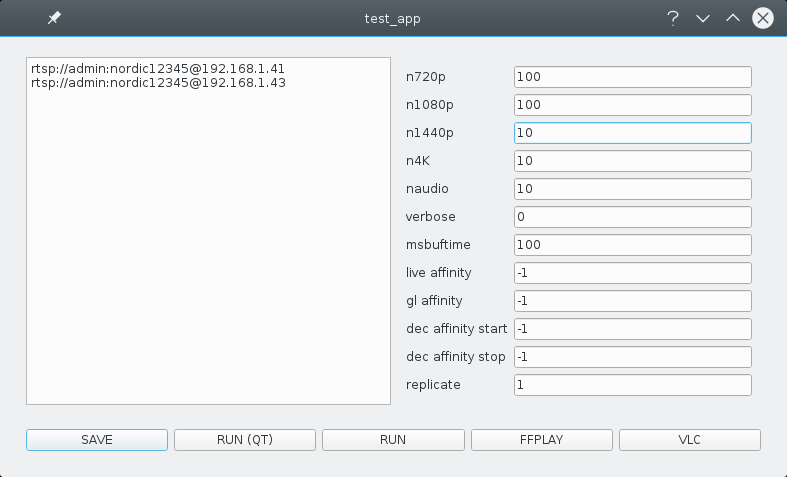

.. _testsuite:

The PyQt testsuite
==================

So, you have installed valkka-core and valkka-examples as instructed :ref:`here<requirements>`.  The same hardware requirements apply here as in the :ref:`tutorial<tutorial>`.

The PyQt testsuite is available at

::

  valkka_examples/api_level_2/qt/

The testsuite is intended for demonstration, benchmarking and ultimate debugging.  Currently the testsuite consists of the following programs:

========================== ==================================================
File                       Explanation
========================== ==================================================
test_studio_1.py           | Live stream from several rtsp cameras
                           | and/or from sources defined in an sdp file
test_studio_detector.py    | Like *test_studio_1.py*, but with a simple
                           | OpenCV analyzer per stream: a movement detector
                           | The *gold standard test* (see below)
test_studio_file.py        Read and play stream from a matroska file
========================== ==================================================

.. note:: When streaming video (from multiple sources) to multiple windows, OpenGL rendering synchronization to vertical refresh ("vsync") should be disabled, as it will limit your total framerate to the refresh rate of your monitor (i.e. to around 50 frames per second).  On MESA based X.org drivers (intel, nouveau, etc.), this can be achieved from command line with "export vblank_mode=0".  With nvidia proprietary drivers, use the nvidia-settings program.  You can test if vsync is disabled with the "glxgears" command (in package "mesa-utils").  Glxgears should report 1000+ frames per second with vsync disabled.

test_studio_1.py
----------------

Do this:

::

  cd valkka_examples/api_level_2/qt/
  python3 test_studio_1.py

The program launches with the following menu:

   
   
The field on the left is used to specify stream sources, one source per line.  For IP cameras, use "rtsp://", for sdp files, just give the filename.  In the above example, we are connecting to two rtsp IP cams.

The fields on the right are:

=========================== ==================================================
Field name                  What it does
=========================== ==================================================
n720p                       Number of pre-reserved frames for 720p resolution
n1080p                      Number of pre-reserved frames for 1080p resolution
n1440p                      etc.
n4K                         etc.
naudio                      (not used)
verbose                     (not used)
msbuftime                   Frame buffering time in milliseconds
live affinity               Bind the streaming thread to a core
gl affinity                 Bind the frame presentation thread to a core
dec affinity start          Bind decoding threads to cores (first core)
dec affinity stop           Bind decoding threads to cores (last core)
replicate                   Dump each stream to screen this many times
=========================== ==================================================

As you learned from the tutorial, in Valkka, frames are pre-reserved on the GPU.  If you're planning to use 720p and 1080p cameras, reserve, say 200 frames for both.

Decoded frames are being queued for "msbuftime" milliseconds.  This is necessary for de-jitter (among other things).  The bigger the buffering time, the more pre-reserved frames you'll need and the more lag you get into your live streaming.  A nice value is 300.

Replicate demonstrates how Valkka can dump the stream (that's decoded only once) to multiple X windows.  Try for example the value 24 - you get each stream on the screen 24 times, without any performance degradation or the need to decode a stream more than once.

In Valkka, all threads can be bound to a certain processor core.  Value "-1" indicates that the thread is unbound.  You can launch, say, KSysGuard in Kubuntu, to watch how the kernel bounces the threads from one processor to another.  To get rid of that, you can bind the threads for example like this:

=================== =====
Field name          value
=================== =====
live affinity       1
gl affinity         2
dec affinity start  3
dec affinity stop   5
=================== =====

Now LiveThread (the thread that streams from cameras) stays at core 1, all OpenGL operations and frame presenting at core 2.  Let's imagine you have ten decoders running, then they will placed like this:

======== ==============
Core     Decoder thread
======== ==============
core 3   1, 4, 7, 10
core 4   2, 5, 8
core 5   3, 6, 9
======== ==============
   
Before starting the test suite, you can use the script

::

  valkka_examples/aux/
   
    process_crowd.bash
    
    
To throw all system processes into core 0.

Is all this fiddling with thread affinities needed?  Not really - just use value "-1" on those fields if you think it doesn't make any difference.  

It certainly doesn't matter if you're streaming and decoding just a few streams.  You can test how many streams your linux box is able to stream, decode and present by observing the core loads with, say, KSysGuard.  When all cores are screaming nearly 100% and smog is coming out of your pc, you'll start to observe frame dropping.  You can test if thread affinities help.

Finally, the buttons that launch the test, do the following:

============= ====================================================
Button        What it does?
============= ====================================================
SAVE          Saves the test configuration (yes, save it)
**RUN(QT)**   Runs THE TEST (after saving, press this!)
RUN           Runs the test without Qt
FFPLAY        Runs the streams in ffplay instead (if installed)
VLC           Runs the streams in vlc instead (if installed)
============= ====================================================

RUN(QT) is the thing you want to do.

test_studio_detector.py
-----------------------

Do this:

::

  cd valkka_examples/api_level_2/qt/
  python3 test_studio_detector.py

This is similar to *test_studio_1.py*.  In addition to presenting the streams on-screen, the decoded frames are passed, once in a second, to OpenCV movement detectors.  When movement is detected, a signal is sent with the Qt signal/slot system to the screen.

This test program is also used in the *gold stardard test*.  Everything is here: streaming, decoding, OpenGL streaming, interface to python and even the posix shared memory and semaphores.  One should be able to run this test with a large number of cameras for a long period of time without excessive memory consumption, or system instabilities.

In our case, the test consists currently of running 10 full-hd (1080p) cameras for several days on a desktop with eight Intel i7-4770 cores, Xeon E3-1200 v3 integrated graphics and 16GB memory.

